# 实验结果分析

本文档分析当前框架上三组代表性实验：SFT、同步 GRPO、异步 GRPO。SFT 结果来自本地日志 `outputs/log/sft-qwen3-1.7B-Base-2.log`，同步/异步 RL 结果来自 W&B run history。

核心结论如下：

- 在当前 GSM8K 设置下，RL 明显强于 SFT：SFT best accuracy 为 `0.6634`，同步 GRPO best accuracy 为 `0.8309`，异步 GRPO best accuracy 为 `0.8294`。
- 同步 GRPO 和异步 GRPO 的训练效果非常接近：step 300 时同步为 `0.8173`，异步为 `0.8150`。
- 异步 GRPO 的系统效率明显更高：完成 300 step 的 wall-clock 从同步的 `6.77h` 降到异步的 `2.84h`，约 `2.38x` 加速。
- `core/eval_accuracy`、`core/eval_reward_mean`、`core/eval_pass_at_1` 在当前 eval 设置下数值等价，因此本文只保留 `core/eval_accuracy` 作为 eval 主指标。

## 1. 实验配置

三组实验都使用 `Qwen3-1.7B-Base`，训练侧使用 4 张 GPU，推理/eval 使用 2 张 GPU。序列长度统一由 `monarch.sequence` 控制，最大 prompt tokens 为 2048，最大 response tokens 为 2048。

| 实验 | 配置文件 | 入口 | 训练步数控制 | 训练数据 | Eval 数据 |
| --- | --- | --- | --- | --- | --- |
| SFT | `config/qwen3_1_7b_gsm8k_sft.yaml` | `main_sft.py` | `num_train_epochs: 3`，实际 699 step | `data/train/gsm8k_train.jsonl` | `data/val/gsm8k_val.jsonl` |
| 同步 GRPO | `config/qwen3_1_7b_gsm8k_grpo.yaml` | `main_rl.py` | `rl.max_steps: 1000`，本次 run 到 300 step | `data/train/gsm8k_train.jsonl` | `data/val/gsm8k_val.jsonl` |
| 异步 GRPO | `config/qwen3_1_7b_gsm8k_grpo_async.yaml` | `main_rl_async.py` | `rl.max_steps: 1000`，本次 run 到 360 step | `data/train/gsm8k_train.jsonl` | `data/val/gsm8k_val.jsonl` |

关键训练和采样参数如下：

| 参数 | SFT | 同步 GRPO | 异步 GRPO |
| --- | ---: | ---: | ---: |
| model | `/ssd/liuls/data/hub/Qwen3-1.7B-Base` | 同左 | 同左 |
| train GPUs / rollout GPUs | 4 / 2 | 4 / 2 | 4 / 2 |
| global batch size | 32 | 32 | 32 |
| micro batch size | 1 | 1 | 1 |
| optimizer lr | `1e-5` | `1e-6` | `1e-6` |
| lr schedule | warmup ratio `0.05` + cosine decay | constant | constant |
| eval sampling | `n=1, temperature=0.7, top_p=0.95` | 同左 | 同左 |
| rollout sampling | 无 | `n=8, temperature=1.0, top_p=0.95` | 同左 |
| rollout batch size | 无 | 4 groups/step，动态采样 multiplier `1.5` | 同左 |
| replay capacity | 无 | 1024 | 1024 |
| max policy age | 无 | 0 | 1 |
| truncated response handling | 无 | `mask_truncated: true` | 同左 |

同步和异步 RL 的主要区别不是算法目标，而是控制流：同步 GRPO 每个 step 严格串行执行 `rollout -> train -> sync`；异步 GRPO 使用 rollout producer 和 trainer consumer 重叠工作，允许 trainer 使用 `max_policy_age <= 1` 的 replay buffer 样本。

## 2. SFT 实验结果分析

SFT 共训练 699 step，对应 3 个 epoch。训练 loss 从 `0.8476` 降到 `0.1032`，说明监督学习目标本身能够正常收敛。

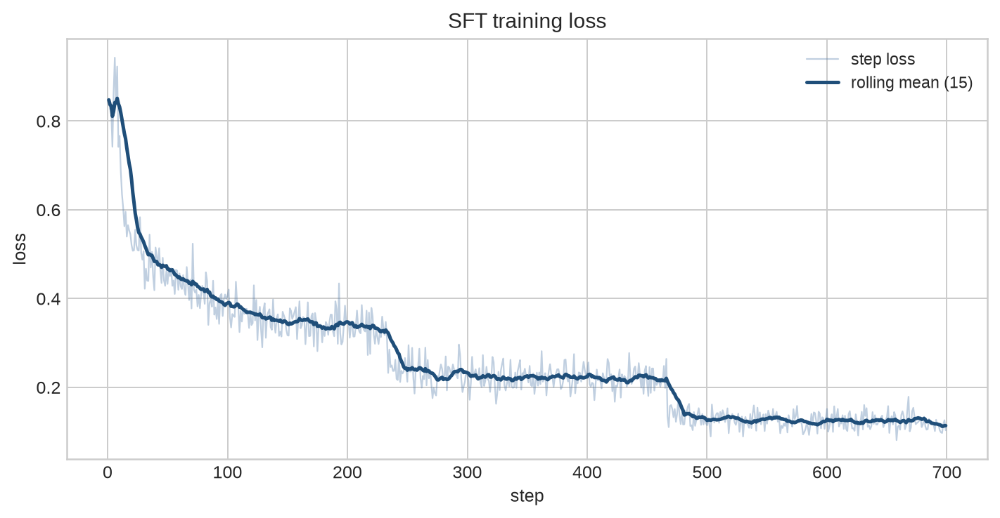

Eval accuracy 从 baseline 的 `0.5550` 提升到最高 `0.6634`，最高点出现在 step 570；最后一次 eval 是 step 690，accuracy 为 `0.6308`。

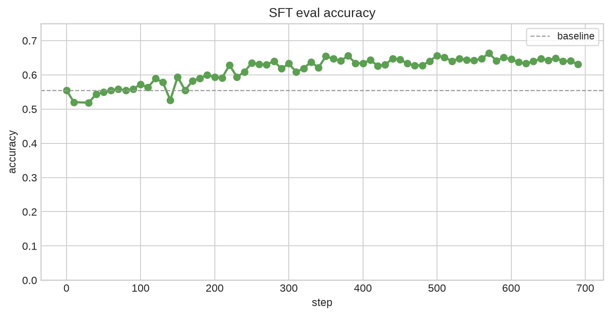

图中剔除了 SFT step 20 的异常 eval 点，以避免单个异常值影响趋势阅读；best/final accuracy 的统计仍基于完整日志。

SFT 的结果说明当前 stepwise VeOmni SFT 路径已经可用，训练 loss 和 eval accuracy 都有正向表现。不过后期 eval 有一定回落，说明 SFT 在当前数据和学习率设置下可能已经进入过拟合或格式敏感区间。后续如果继续优化 SFT，优先方向应该是保存 best eval checkpoint、减小后期训练强度、或者增加更严格的输出格式一致性约束。

## 3. RL 实验结果分析

### 3.1 Eval Accuracy

同步 GRPO 运行到 300 step，异步 GRPO 运行到 360 step。两者的 eval accuracy 都从约 `0.54` 提升到 `0.80+`，明显高于 SFT。

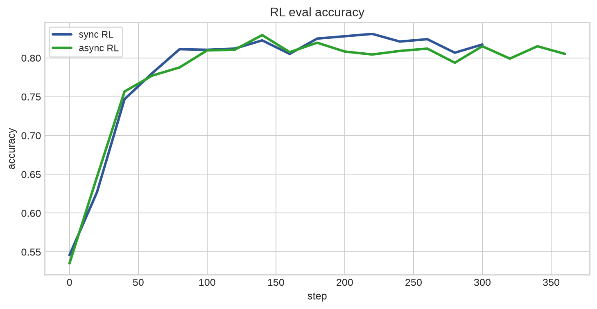

| 指标 | 同步 GRPO | 异步 GRPO |
| --- | ---: | ---: |
| baseline accuracy | 0.5459 | 0.5353 |
| best accuracy | 0.8309 @ step 220 | 0.8294 @ step 140 |
| step 300 accuracy | 0.8173 | 0.8150 |
| final accuracy | 0.8173 @ step 300 | 0.8052 @ step 360 |

异步训练在 step 300 的 accuracy 与同步几乎一致，说明当前 `max_policy_age: 1` 的轻微 stale policy 没有明显破坏训练效果。异步 run 在 step 140 达到最高点，之后存在轻微波动和回落，这部分需要结合 policy lag、动态采样有效率和学习率策略继续观察。

### 3.2 时间效率

同步 RL 的每个 step 必须等待 rollout 完成后才能训练，训练完成后再同步权重。异步 RL 把 rollout producer 和 trainer consumer 拆开，trainer 只要 replay buffer 中有可用 batch 就能继续训练。

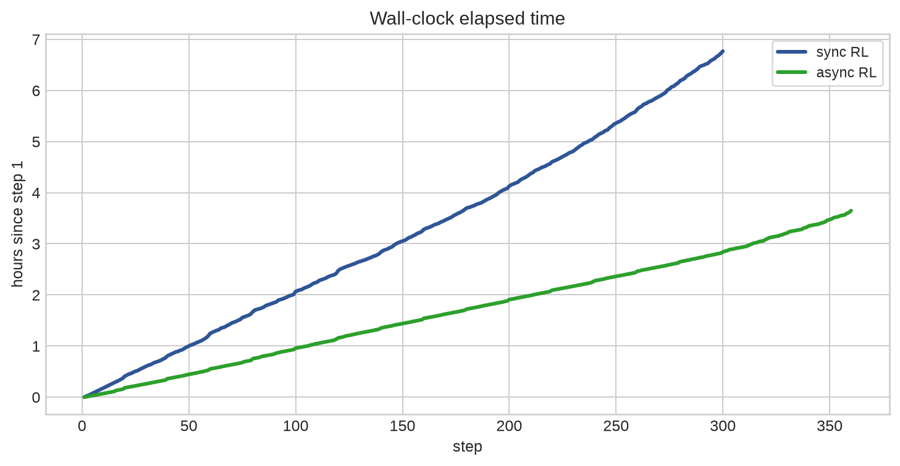

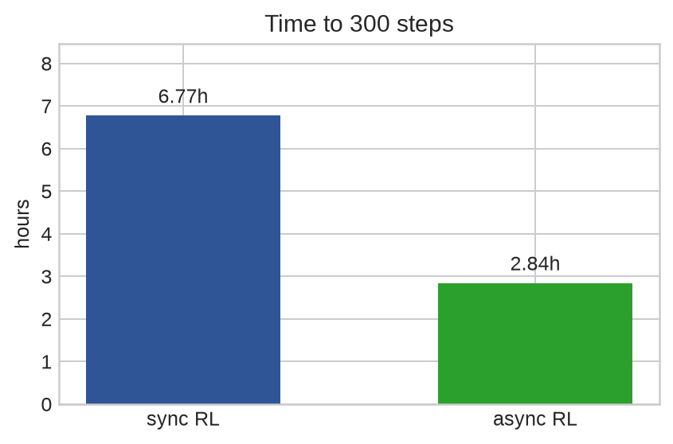

| 阶段 | 同步 GRPO | 异步 GRPO | 加速比 |
| --- | ---: | ---: | ---: |
| 100 step wall-clock | 2.07 h | 0.96 h | 2.16x |
| 200 step wall-clock | 4.13 h | 1.91 h | 2.16x |
| 300 step wall-clock | 6.77 h | 2.84 h | 2.38x |

300 step 对比是最重要的系统指标：异步 GRPO 用 `2.84h` 完成 300 step，同步 GRPO 需要 `6.77h`，整体 wall-clock 缩短约 `58%`。训练 step 本身的耗时差异不大，同步平均 `26.52s/step`，异步平均 `25.72s/step`，因此主要收益来自 rollout 与 train 的重叠，而不是单步训练 kernel 变快。

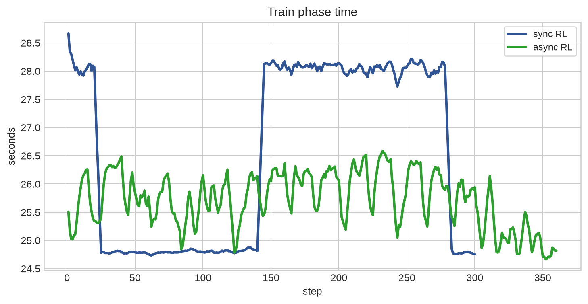

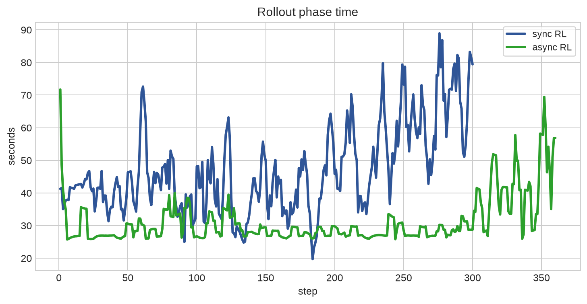

需要注意，异步中的 `core/rollout_time_sec` 是 producer 窗口统计，不等价于同步模式中每个 step 必须等待的阻塞时间。异步模式下更应该结合 wall-clock、buffer size 和 wait buffer time 判断端到端吞吐。

### 3.3 Rollout 与动态采样

动态采样有效 group rate 在同步和异步中非常接近：同步均值 `0.4489`，异步均值 `0.4431`。这说明两种控制流面对相同数据和 reward 时，低方差过滤后的有效样本比例基本一致。

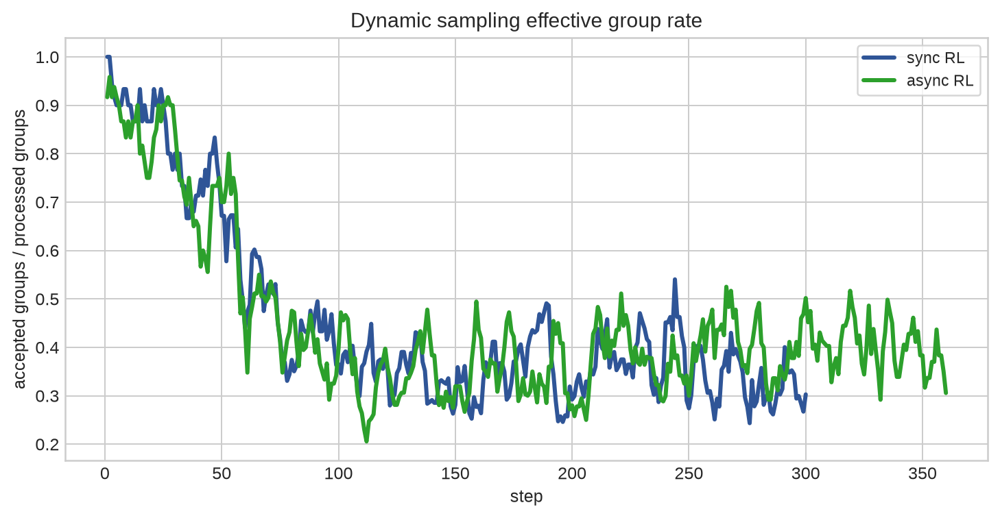

Rollout reward mean 随训练提升，说明 policy 采样质量在变好。同步均值为 `0.8212`，异步均值为 `0.7605`；异步均值偏低主要受早期和 producer 窗口统计影响，最终 step 两者分别为 `0.8194` 和 `0.8250`。

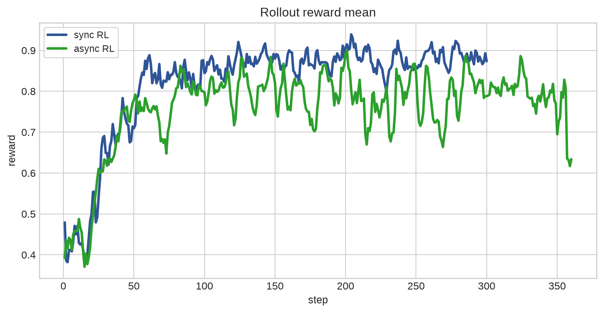

Response length 是当前 RL 实验中需要长期监控的核心指标。异步平均 response token 更短：同步均值 `272.1`，异步均值 `226.5`。两者截断率都较低，同步平均 `1.07%`，异步平均 `0.11%`。这次实验没有再出现早期“输出越来越短导致 eval 归零”的崩溃现象。

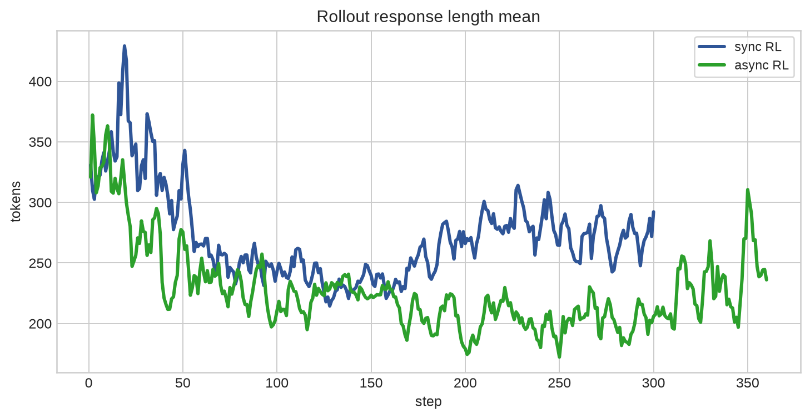

### 3.4 GRPO Loss、Approx KL 与 Grad Norm

GRPO loss 本身不是单调指标，因为它受到 advantage 分布、policy ratio、clip 和 KL 的共同影响。相比 loss，更稳定的监控指标是 Approx KL 和 grad norm。

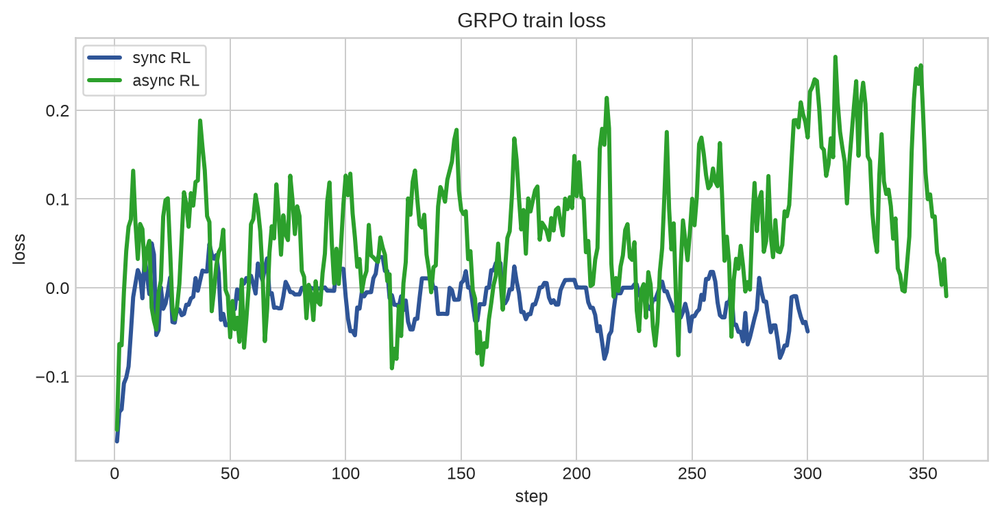

Approx KL 用来近似衡量当前训练 policy 与生成样本时的 old policy 之间的偏移程度。当前实现中，每个训练样本保存 rollout 时的 `generator_logprobs`，训练时重新计算当前 policy 对同一 token 的 logprob，并基于二者的差值计算近似 KL。直观上，Approx KL 越大，表示当前 policy 相比采样 policy 更新越激进；如果该值持续升高，说明 policy 可能正在远离生成数据的分布，训练会更不稳定。

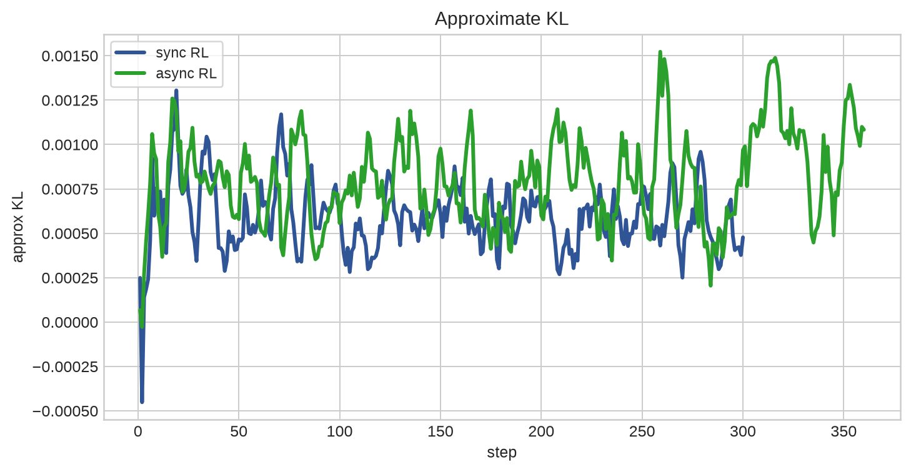

本次实验中 Approx KL 在两个 run 中都保持在较小范围内：同步均值 `5.93e-4`，异步均值 `8.10e-4`，最大值都在 `0.002` 左右。这说明当前 learning rate、clip、动态采样和权重同步设置没有让 policy 快速偏离 rollout policy。

Grad norm 在早期较高，随后进入更稳定区间。同步 run 出现过较高的 early spike，最大 `14.75`；异步 run 最大 `4.67`，均值 `1.98`。总体上两个 run 都没有持续梯度爆炸。

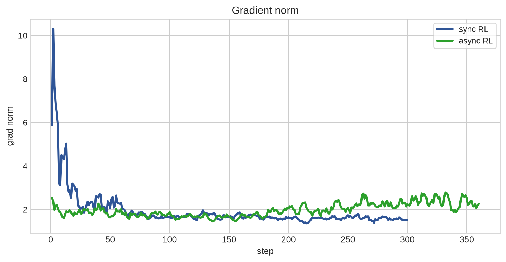

### 3.5 异步运行状态

异步 RL 的关键是 replay buffer 能否持续供给 trainer。当前 run 中 buffer size 平均约 `67.8`，最大 `184`，最小 `8`，说明 producer 大多数时间能够提前准备样本。

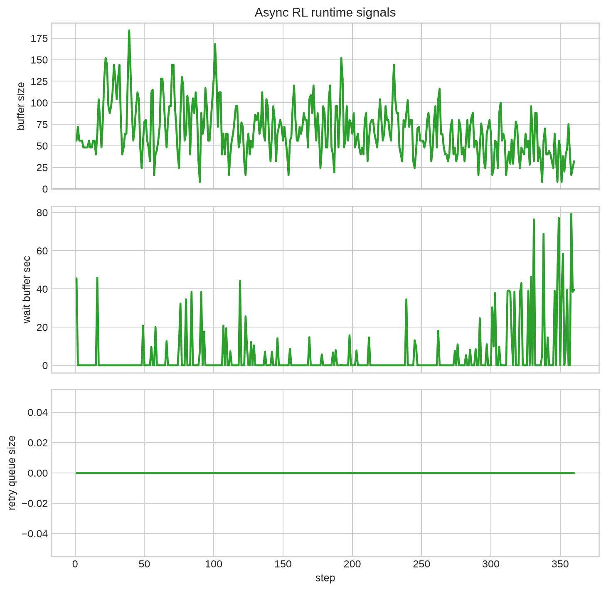

`async/train_wait_buffer_sec` 均值为 `5.04s`，但最大达到 `79.35s`。这说明异步模式虽然显著提升了整体吞吐，但仍存在长尾 rollout 或动态采样有效率下降导致 trainer 等 buffer 的情况。当前整批 retry 的 `retry_queue_size` 在 W&B 记录中始终为 0，说明这次实验没有形成持续堆积的 retry 压力。

后续优化方向：

- 增大 replay buffer 的低水位线，避免 trainer 过早消耗到空 buffer。
- 在 producer 侧增加更多并行 rollout iteration 或更细粒度的请求切分，降低长尾样本影响。
- 对过长或低质量 prompt 做预过滤，减少动态采样反复补样的成本。
- 将 max policy age、rollout batch multiplier 和 replay capacity 联合调参，平衡吞吐和 off-policy 程度。

## 4. 综合对比分析

下图把 SFT、同步 GRPO 和异步 GRPO 的 eval accuracy 放在同一坐标系中。SFT 在前中期有稳定提升，但整体上明显低于两组 RL；同步和异步 GRPO 的曲线高度接近，主要差异体现在系统效率而不是最终 accuracy。为了保持趋势可读性，图中同样剔除了 SFT step 20 的异常 eval 点。

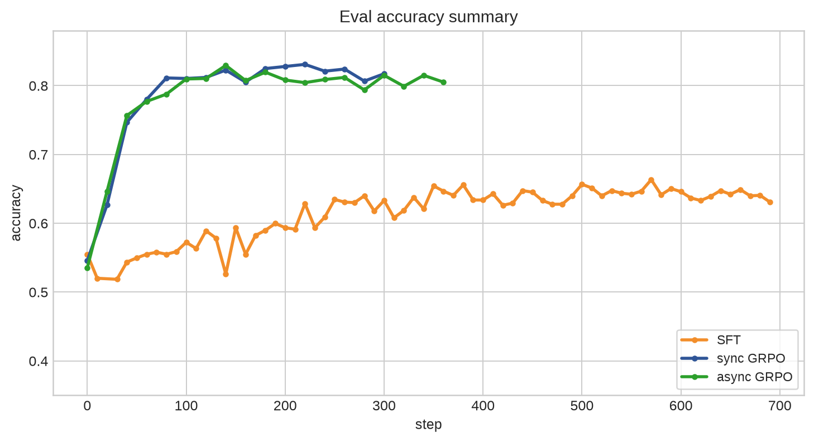

| 实验 | Best accuracy | Final accuracy | 训练/运行时间 | 主要结论 |
| --- | ---: | ---: | ---: | --- |
| SFT | 0.6634 @ step 570 | 0.6308 @ step 690 | 约 6.19 h | 监督训练链路可用，但效果显著低于 RL |
| 同步 GRPO | 0.8309 @ step 220 | 0.8173 @ step 300 | 300 step 约 6.77 h | 算法基准稳定，效果最好 |
| 异步 GRPO | 0.8294 @ step 140 | 0.8052 @ step 360 | 300 step 约 2.84 h | 效果接近同步，系统吞吐显著更高 |

从效果看，RL 明显优于 SFT。SFT 验证了训练链路和数据格式没有根本问题，但在当前设置下，GRPO 通过在线采样、reward 反馈和动态采样过滤，能够把 eval accuracy 推到 `0.80+`。

从同步/异步对比看，同步 GRPO 更适合作为算法正确性基准，因为每个 step 的 rollout、train、sync 都是严格串行的，数据版本最清晰。异步 GRPO 更适合作为系统效率路径，因为它把采样和训练解耦，在效果接近同步的同时显著减少 wall-clock。

当前结果支持后续继续沿两条线推进：

- 算法线：以同步 GRPO 作为 reference，继续验证 reward、advantage、clip、KL、response length 和 eval 的正确性。
- 系统线：以异步 GRPO 作为吞吐优化方向，继续优化 replay buffer 水位、rollout producer 并行度、长尾样本处理和 stale policy 控制。

整体上，当前实验已经说明 Actor 化架构能够同时支持 SFT、同步 RL 和异步 RL，并且异步控制流能够在不明显损失训练效果的前提下带来实用的系统加速。
